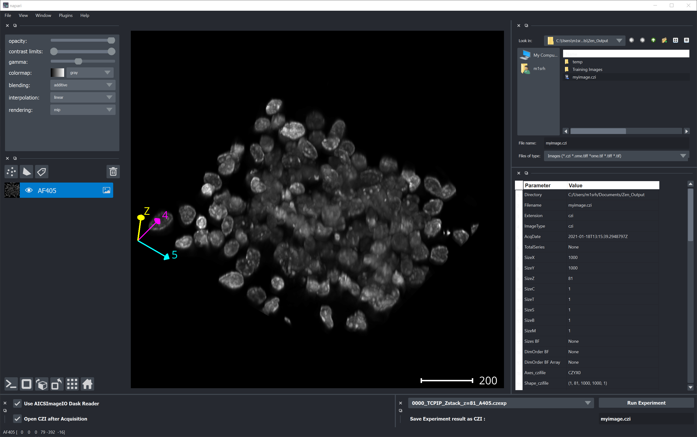

# napari_zeiss

## Simple Viewing Images

Playing around with the Napari Viewer is fun. This example illustrates how to add wto widgets to the viewer.

- 1st widget can be:
  - **FileBrowser** --> Clicking on File will automatically open it inside the Viewer. The selected file is highlighted in green.
  - **TreeView** --> Clicking on a file will open it inside the Viewer
- 2nd widget is a table view, which displays some metadata of the current image

Disclaimer: This a prototype and just meant to be an example. Use at your own risk!


The main function to add the iamge stack to the viewer is shown below:

```python
def show_image_napari(array, metadata,
                      blending='additive',
                      gamma=0.75,
                      rename_sliders=False):
    """Show the multidimensional array using the napari viewer

    :param array: multidimensional NumPy.Array containing the pixeldata
    :type array: NumPy.Array
    :param metadata: dictionary with CZI or OME-TIFF metadata
    :type metadata: dict
    :param blending: napari viewer option for blending, defaults to 'additive'
    :type blending: str, optional
    :param gamma: napari viewer value for Gamma, defaults to 0.85
    :type gamma: float, optional
    :param rename_sliders: name slider with correct labels, defaults to False
    :type verbose: bool, optional
    """

    # create scalefcator with all ones
    scalefactors = [1.0] * len(array.shape)
    dimpos = imf.get_dimpositions(metadata['Axes_aics'])

    # get the scalefactors from the metadata
    scalef = imf.get_scalefactor(metadata)

    # modify the tuple for the scales for napari
    scalefactors[dimpos['Z']] = scalef['zx']

    # remove C dimension from scalefactor
    scalefactors_ch = scalefactors.copy()
    del scalefactors_ch[dimpos['C']]

    if metadata['SizeC'] > 1:
        # add all channels as layers
        for ch in range(metadata['SizeC']):

            try:
                # get the channel name
                chname = metadata['Channels'][ch]
            except KeyError as e:
                print(e)
                # or use CH1 etc. as string for the name
                chname = 'CH' + str(ch + 1)

            # cut out channel
            # use dask if array is a dask.array
            if isinstance(array, da.Array):
                print('Extract Channel as Dask.Array')
                channel = array.compute().take(ch, axis=dimpos['C'])

            else:
                # use normal numpy if not
                print('Extract Channel as NumPy.Array')
                channel = array.take(ch, axis=dimpos['C'])

            # actually show the image array
            print('Adding Channel  : ', chname)
            print('Shape Channel   : ', ch, channel.shape)
            print('Scaling Factors : ', scalefactors_ch)

            # get min-max values for initial scaling
            clim = imf.calc_scaling(channel,
                                    corr_min=1.0,
                                    offset_min=0,
                                    corr_max=0.85,
                                    offset_max=0)

            # add channel to napari viewer
            viewer.add_image(channel,
                             name=chname,
                             scale=scalefactors_ch,
                             contrast_limits=clim,
                             blending=blending,
                             gamma=gamma)

    if metadata['SizeC'] == 1:

        # just add one channel as a layer
        try:
            # get the channel name
            chname = metadata['Channels'][0]
        except KeyError:
            # or use CH1 etc. as string for the name
            chname = 'CH' + str(ch + 1)

        # actually show the image array
        print('Adding Channel: ', chname)
        print('Scaling Factors: ', scalefactors)

        # use dask if array is a dask.array
        if isinstance(array, da.Array):
            print('Extract Channel using Dask.Array')
            array = array.compute()

        # get min-max values for initial scaling
        clim = imf.calc_scaling(array)

        viewer.add_image(array,
                         name=chname,
                         scale=scalefactors,
                         contrast_limits=clim,
                         blending=blending,
                         gamma=gamma)

    if rename_sliders:

        print('Renaming the Sliders based on the Dimension String ....')

        if metadata['SizeC'] == 1:

            # get the position of dimension entries after removing C dimension
            dimpos_viewer = imf.get_dimpositions(metadata['Axes_aics'])

            # get the label of the sliders
            sliders = viewer.dims.axis_labels

            # update the labels with the correct dimension strings
            slidernames = ['B', 'S', 'T', 'Z', 'C']

        if metadata['SizeC'] > 1:

            new_dimstring = metadata['Axes_aics'].replace('C', '')

            # get the position of dimension entries after removing C dimension
            dimpos_viewer = imf.get_dimpositions(new_dimstring)

            # get the label of the sliders
            # for napari <= 0.4.2 this returns a list
            # and >= 0.4.3 it will return a tuple
            sliders = viewer.dims.axis_labels

            # update the labels with the correct dimension strings
            slidernames = ['B', 'S', 'T', 'Z']

        for s in slidernames:
            if dimpos_viewer[s] >= 0:
                try:
                    # this seems to work for napari <= 0.4.2

                    # assign the dimension labels
                    sliders[dimpos_viewer[s]] = s
                except TypeError:
                    # this works for napari >= 0.4.3

                    # convert to list()
                    tmp_sliders = list(sliders)

                    # assign the dimension labels
                    tmp_sliders[dimpos_viewer[s]] = s

                    # convert back to tuple
                    sliders = tuple(tmp_sliders)

        # apply the new labels to the viewer
        viewer.dims.axis_labels = sliders
```

## Start a ZEN experiment from the Napari viewer

The Napari viewer allows to add even more interesting widgets. As a "fun project" it is possible to start a ZEN experiment from with Napari by sending ZEN python commands over TCP-IP.

For more information about controlling see: [ZEN Blue - TCP-IP Interface](https://github.com/zeiss-microscopy/OAD/tree/master/Interfaces/TCP-IP_interface)

In order to start an experiment from Napari there are a few new widgets:

- Selector for ZEN Experiments (*.czexp)
- Button **Run Experiment** to actually start a pre-configured in ZEN Blue
- Option to open an newly acquired CZI directly after the experiment is finished



***

<video width="640" height="480" controls>
  <source src="images/Napari_simulated_CD7_TCPIP_Run_Experiment.mp4" type="video/mp4">
</video>
